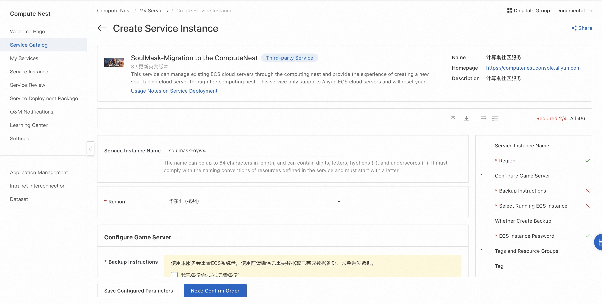
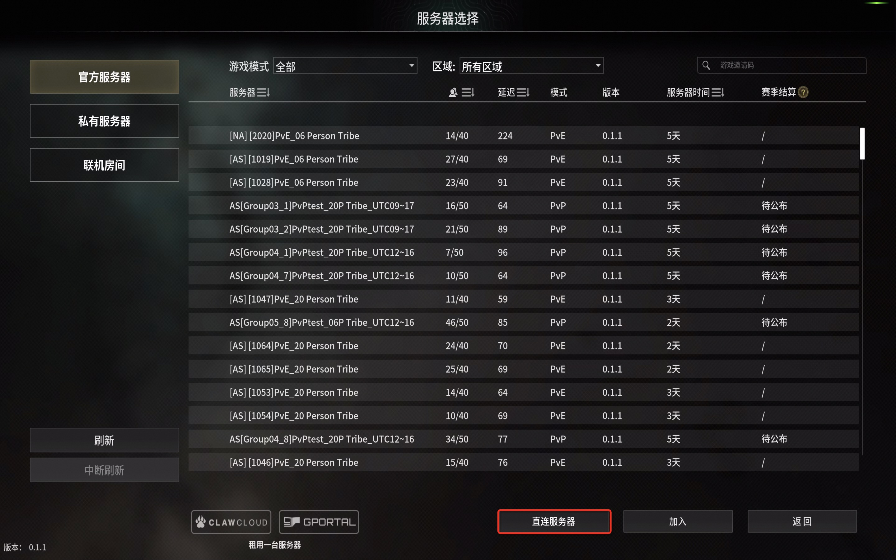
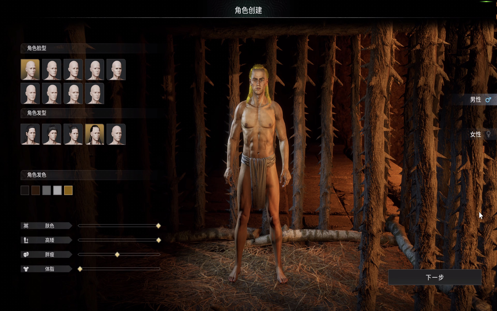

<h1>5 minutes, migrate the Soul Face A server to the computing nest </h1>

The migration process is simple:

<ol start="1">
<li>
Create a computing nest soul face A migration service instance

</li>
<li>
 After the service instance is created, obtain the service address on the details page
<li>
 login Steam account to start the game, select the direct connection server, paste the computing nest server address and port and join the server.

</li>
<li>
 Start the game!

</li>
</ol>
